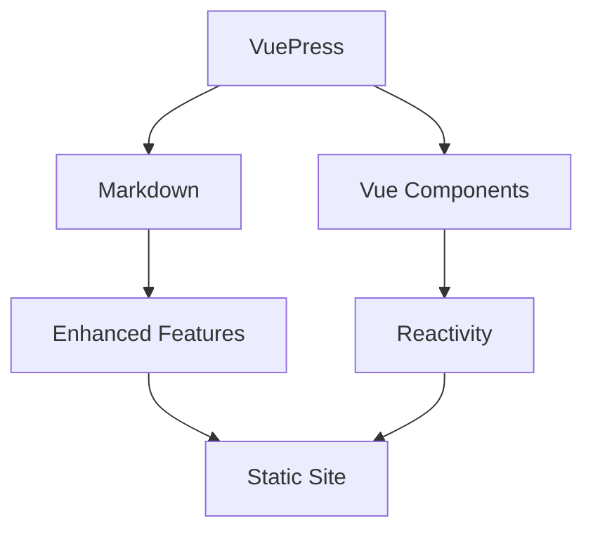

# 🚀 Advanced Examples

This page demonstrates advanced VuePress features and sophisticated usage patterns.

## 🎯 Advanced Vue Component Integration

<AdvancedDemo />

## 📊 Data Visualization Examples

### Interactive Charts with Vue

Here's how you can create interactive data visualizations in VuePress:

```vue
<template>
  <div class="chart">
    <div v-for="(item, index) in data" :key="index" class="bar">
      <div 
        class="bar-fill" 
        :style="{ height: item.value + '%' }"
        @click="selectBar(index)"
      ></div>
      <span>{{ item.label }}</span>
    </div>
  </div>
</template>

<script>
export default {
  data() {
    return {
      data: [
        { label: 'Jan', value: 45 },
        { label: 'Feb', value: 67 },
        { label: 'Mar', value: 89 }
      ]
    }
  },
  methods: {
    selectBar(index) {
      console.log('Selected:', this.data[index])
    }
  }
}
</script>
```

## 🎨 Advanced Markdown Features

### Custom Containers

::: tip Advanced Tip
You can create custom containers with different styles and icons for better content organization.
:::

::: warning Performance Note
When using heavy Vue components, consider lazy loading for better performance.
:::

::: danger Security Alert
Always validate user input in production applications.
:::

::: details Click to see implementation
```javascript
// Custom container implementation
const container = require('markdown-it-container')

module.exports = {
  markdown: {
    config: md => {
      md.use(container, 'tip')
      md.use(container, 'warning')
      md.use(container, 'danger')
    }
  }
}
```
:::

### Advanced Code Examples

#### Syntax Highlighting with Line Numbers

```javascript{1,3-5}
// Advanced VuePress configuration
module.exports = {
  title: 'My VuePress Site',
  themeConfig: {
    sidebar: 'auto'
  },
  plugins: [
    '@vuepress/back-to-top',
    '@vuepress/nprogress'
  ]
}
```

#### Multi-language Code Groups

<CodeGroup>
<CodeGroupItem title="Vue 3">

```vue
<template>
  <div>{{ message }}</div>
</template>

<script setup>
import { ref } from 'vue'
const message = ref('Hello Vue 3!')
</script>
```

</CodeGroupItem>

<CodeGroupItem title="Vue 2">

```vue
<template>
  <div>{{ message }}</div>
</template>

<script>
export default {
  data() {
    return {
      message: 'Hello Vue 2!'
    }
  }
}
</script>
```

</CodeGroupItem>

<CodeGroupItem title="React">

```jsx
import React, { useState } from 'react'

function Component() {
  const [message] = useState('Hello React!')
  return <div>{message}</div>
}
```

</CodeGroupItem>
</CodeGroup>

### Mathematical Expressions

When you need to display mathematical formulas:

Inline math: $E = mc^2$

Block math:
$$
\sum_{i=1}^{n} x_i = x_1 + x_2 + \cdots + x_n
$$

### Mermaid Diagrams



## 🔧 Advanced Configuration Patterns

### Dynamic Sidebar Generation

```javascript
// .vuepress/config.js
const fs = require('fs')
const path = require('path')

function generateSidebar(dir) {
  const files = fs.readdirSync(path.join(__dirname, '../', dir))
  return files
    .filter(file => file.endsWith('.md') && file !== 'README.md')
    .map(file => `${dir}/${file.replace('.md', '')}`)
}

module.exports = {
  themeConfig: {
    sidebar: {
      '/guide/': generateSidebar('guide'),
      '/examples/': generateSidebar('examples')
    }
  }
}
```

### Custom Plugin Development

```javascript
// plugins/my-plugin.js
module.exports = (options, context) => ({
  name: 'my-custom-plugin',
  
  async ready() {
    console.log('Plugin is ready!')
  },
  
  extendPageData(pageContext) {
    const { frontmatter } = pageContext
    frontmatter.customField = 'Added by plugin'
  },
  
  chainWebpack(config, isServer) {
    // Modify webpack configuration
    config.resolve.alias.set('@custom', path.resolve('custom'))
  }
})
```

### Advanced Theme Customization

```stylus
// .vuepress/styles/index.styl

// Custom CSS variables
:root
  --custom-accent: #ff6b6b
  --custom-bg: #f8f9fa

// Component overrides
.navbar
  border-bottom: 2px solid var(--custom-accent)
  
.sidebar
  background: var(--custom-bg)
  
// Custom animations
@keyframes fadeInUp
  from
    opacity: 0
    transform: translateY(30px)
  to
    opacity: 1
    transform: translateY(0)

.content
  animation: fadeInUp 0.6s ease-out
```

## 🚀 Performance Optimization

### Lazy Loading Components

```vue
<template>
  <div>
    <component :is="heavyComponent" v-if="shouldLoad" />
    <button @click="loadComponent" v-else>
      Load Heavy Component
    </button>
  </div>
</template>

<script>
export default {
  data() {
    return {
      shouldLoad: false,
      heavyComponent: null
    }
  },
  methods: {
    async loadComponent() {
      if (!this.heavyComponent) {
        this.heavyComponent = () => import('./HeavyComponent.vue')
      }
      this.shouldLoad = true
    }
  }
}
</script>
```

### Service Worker Integration

```javascript
// .vuepress/config.js
module.exports = {
  serviceWorker: true,
  
  head: [
    ['link', { rel: 'manifest', href: '/manifest.json' }],
    ['meta', { name: 'theme-color', content: '#3eaf7c' }]
  ],
  
  plugins: [
    ['@vuepress/pwa', {
      serviceWorker: true,
      updatePopup: {
        message: "New content available",
        buttonText: "Refresh"
      }
    }]
  ]
}
```

## 🎭 Advanced Styling Techniques

### CSS Grid Layouts

<div class="advanced-grid">
  <div class="grid-item header">Header</div>
  <div class="grid-item sidebar">Sidebar</div>
  <div class="grid-item main">Main Content</div>
  <div class="grid-item footer">Footer</div>
</div>

<style>
.advanced-grid {
  display: grid;
  grid-template-areas: 
    "header header"
    "sidebar main"
    "footer footer";
  grid-template-columns: 200px 1fr;
  grid-template-rows: 60px 1fr 40px;
  gap: 10px;
  height: 300px;
  margin: 20px 0;
}

.grid-item {
  padding: 15px;
  background: linear-gradient(135deg, #667eea 0%, #764ba2 100%);
  color: white;
  border-radius: 8px;
  display: flex;
  align-items: center;
  justify-content: center;
  font-weight: bold;
}

.header { grid-area: header; }
.sidebar { grid-area: sidebar; }
.main { grid-area: main; }
.footer { grid-area: footer; }

@media (max-width: 768px) {
  .advanced-grid {
    grid-template-areas:
      "header"
      "sidebar"
      "main"
      "footer";
    grid-template-columns: 1fr;
    grid-template-rows: auto;
  }
}
</style>

## 🌟 Interactive Examples

### Custom Vue Component Usage

Here's how to use our advanced demo component with custom props:

<AdvancedDemo />

### Badge System

<Badge text="beta" type="warning" /> <Badge text="new" type="tip" /> <Badge text="advanced" type="error" />

## 📚 Further Reading

- [Vue.js Guide](https://vuejs.org/guide/)
- [VuePress Plugin Development](https://vuepress.vuejs.org/plugin/)
- [Markdown Extensions](https://vuepress.vuejs.org/guide/markdown.html)
- [Theme Development](https://vuepress.vuejs.org/theme/)

---

*This page demonstrates the power and flexibility of VuePress for creating sophisticated documentation sites with interactive components and advanced features.*